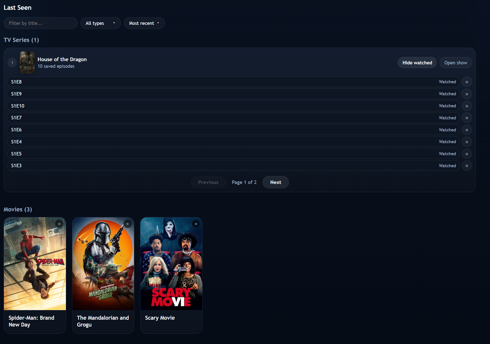
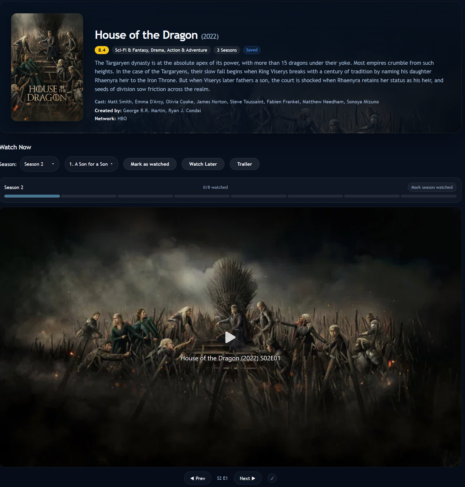
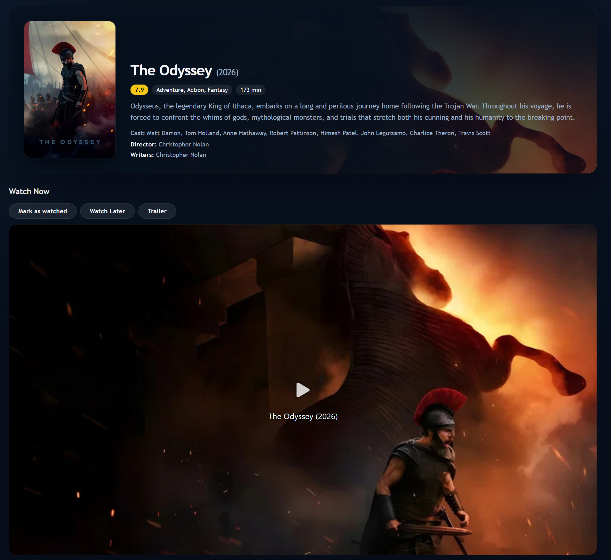
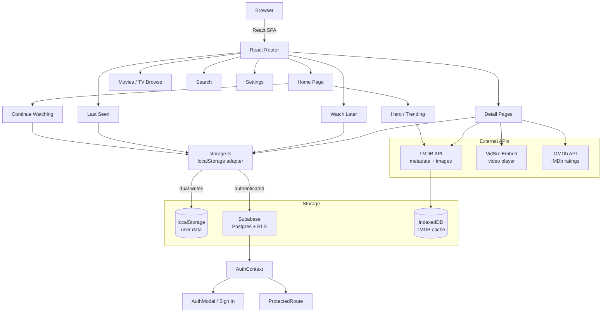

# StreamFlow

A personal streaming web app built with React and TypeScript. Browse movies and TV shows using TMDB metadata, watch via embedded players, and track your viewing progress. Everything works locally with no sign-up required, and an optional Supabase account syncs your library, watch history, and settings across devices.

## Screenshots

<table border="0">
  <tr>
    <td width="50%" align="center" valign="top">
      
      <br />
      <sub><b>Landing Page</b></sub>
    </td>
    <td width="50%" align="center" valign="top">
      
      <br />
      <sub><b>Last Seen</b></sub>
    </td>
  </tr>
  <tr>
    <td width="50%" align="center" valign="top">
      
      <br />
      <sub><b>TV Series View</b></sub>
    </td>
    <td width="50%" align="center" valign="top">
      
      <br />
      <sub><b>Movie View</b></sub>
    </td>
  </tr>
</table>

## Architecture



## Features

### Browsing & Watching
- **Browse** movies and TV shows with filters (genre, country, year, date range, sort order, original language, minimum vote count), on both movie and TV pages
- **Search** across movies, TV shows, and people
- **Watch** content via embedded video player with resume playback
- **IMDb ratings** (OMDb) shown on cards, detail pages, and per episode; falls back to TMDB ratings where unavailable
- **Continue Watching** tracks progress and shows unfinished content on the home page
- **Auto-detect watched** episodes are marked automatically when you click Next or reach the end
- **Episode navigation** season/episode dropdowns with keyboard search, prev/next buttons
- **Next-episode autoplay** when an episode finishes (or reaches the end), a short countdown offers "Play now" or "Cancel" to advance automatically
- **Keyboard shortcuts** while watching: N = next episode, P = previous episode, W = toggle watched
- **Trailers** YouTube trailers on detail pages when available
- **Recommendations** "You might also like" section on movie and show detail pages
- **Background new-episode scan** detects fresh releases for your Watch Later series and marks "series watched" shows with new episodes, showing them in the notification bell (throttled to once/hour)
- **Request cancellation** in-flight API requests are cancelled on navigation to prevent stale data

### Watch Later
- Save movies, shows, or individual episodes to Watch Later
- **Release Calendar** shows upcoming releases from your library:
  - Month grid with poster thumbnails on release days
  - **Heatmap effect** — busier days glow progressively brighter
  - **Past days** are greyed out to show the date has passed
  - **Adaptive posters** — posters scale up when a day has few releases and shrink to fit when it's busy
  - Day panel with modern release cards (poster + title + episode info + Open)
  - Entrance animations, staggered grid cascade, and loading skeletons

### Accounts & Sync (optional)
- **Guest mode** — browse, search, and watch everything with no account; personal features (Watch Later, Last Seen, Notifications, Settings) prompt a sign-in
- **Sign In / Register** via a global modal (forgot-password flow included) with focus trap, scroll lock, and Escape/outside-click to close
- **Cloud sync** — watched marks, progress, watch later, notifications, search history, and settings sync to Supabase with Row Level Security
- **Local-first storage** — every write goes to localStorage instantly and to Supabase in the background; the app is fully functional offline or without Supabase configured
- **Offline resilience** — failed sync writes are queued and retried with exponential backoff
- **One-time migration** — after signing in, local data is uploaded to the cloud and the app continues reading from localStorage
- **Backup & restore** — export/import your data as JSON, both local and cloud versions

### Polish
- **Last Seen** view your watch history grouped by series
- **Error boundary** catches render crashes with retry button and error logging
- **Back to top** floating button appears after scrolling down
- **Accessibility** ARIA roles, labels, skip-to-content link, keyboard navigation, screen reader announcements
- **Dark theme** with responsive layout
- **Loading skeletons** with shimmer animations across grids, history, and the release calendar

## Tech Stack

- [React 19](https://react.dev) + [Vite](https://vite.dev) + TypeScript
- [React Router](https://reactrouter.com) for client-side routing
- [TMDB API](https://developer.themoviedb.org) for metadata, images, and search
- [OMDb API](https://www.omdbapi.com) for IMDb ratings (cards, detail pages, episodes)
- [VidSrc](https://vidsrc.fyi) for video embeds
- [Supabase](https://supabase.com) for optional authentication and cloud sync (Postgres + RLS)
- CSS Modules for scoped styling
- localStorage for local user data (watched marks, progress, watch later lists)
- IndexedDB for TMDB API response cache (larger quota than localStorage)
- [Vitest](https://vitest.dev) for unit tests

## Getting Started

### Prerequisites

- Node.js 20.19+ (or 22.12+)
- A free [TMDB API key](https://www.themoviedb.org/settings/api)
- Optional: a free [OMDb API key](https://www.omdbapi.com/apikey.aspx) for IMDb ratings
- Optional: a free [Supabase project](https://supabase.com) for accounts + cloud sync

### Setup

```bash
git clone https://github.com/AdeiTamayo/StreamingPlatform.git
cd StreamingPlatform
npm install
```

Create a `.env` file in the project root (see `.env.example`):

```
VITE_TMDB_API_KEY=your_tmdb_api_key_here
VITE_OMDB_API_KEY=your_omdb_api_key_here        # optional, enables IMDb ratings
VITE_SUPABASE_URL=your_supabase_project_url   # optional
VITE_SUPABASE_ANON_KEY=your_supabase_anon_key # optional
```

`VITE_OMDB_API_KEY` is optional — without it the app shows TMDB ratings instead. `VITE_SUPABASE_URL` and `VITE_SUPABASE_ANON_KEY` are optional — without them the app runs entirely in local-only mode (no sign-in).

### Setting up Supabase (optional)

1. Create a project at [supabase.com](https://supabase.com)
2. In the SQL editor, run the migration file in `supabase/migrations/001_initial_schema.sql` — this creates all 6 tables (watched, progress, watch_later, notifications, search_history, settings), their indexes and unique constraints, and Row Level Security policies
3. Copy your project URL and anon key into `.env`

### Migrating existing local data

If you already used the app before adding Supabase, run:

```bash
npm run transfer:supabase
```

This prints a snippet to paste into the browser console while on the app, which uploads your existing localStorage data to your account (or just sign in — the app attempts this migration automatically on login).

### Build

```bash
npm run build
```

Output goes to the `dist/` directory.

### Tests

```bash
npm run test
```

## Deploying to Vercel

This project is ready for Vercel deployment. The `vercel.json` configures SPA routing (all routes redirect to `index.html`).

1. Push to GitHub
2. Import the repo on [vercel.com](https://vercel.com)
3. Add `VITE_TMDB_API_KEY`, optionally `VITE_OMDB_API_KEY`, `VITE_SUPABASE_URL` + `VITE_SUPABASE_ANON_KEY`, as environment variables in the Vercel dashboard
4. Deploy

Vercel will auto-deploy on every push to `main`.

## Project Structure

```
src/
  api/
    tmdb.ts             # TMDB API calls with caching + AbortSignal support
    omdb.ts             # OMDb IMDb rating lookups (per-episode + by title), cached in localStorage
    vidsrc.ts           # Embed URL builders
    storage.ts          # Local-first data adapter (localStorage + Supabase dual writes)
    storageBackup.ts    # Export/import Supabase data as JSON
    tmdbCache.ts        # IndexedDB cache for TMDB API responses
    tvStatusCache.ts    # Cache for TV airing status
    newEpisodeScan.ts   # Background new-episode detection for Watch Later series
  repositories/
    watchedRepository.ts       # Supabase writes for watched marks
    progressRepository.ts      # Supabase writes for playback progress
    watchLaterRepository.ts    # Supabase writes for watch later lists
    notificationRepository.ts  # Supabase writes for notifications
    searchHistoryRepository.ts # Supabase writes for search history
    settingsRepository.ts      # Supabase writes for settings
  services/auth/
    authService.ts      # Supabase auth wrapper (sign in/up/out, reset password, session)
  context/
    AuthContext.tsx     # Auth state + global auth modal state
  components/
    Navbar.tsx          # Sticky top navigation with sidebar (guest vs signed-in)
    AuthModal/          # Global sign-in modal: Login, Register, ForgotPassword forms
    ProtectedRoute/     # Gates personal pages behind auth, opens modal for guests
    AccountButton/      # "Sign In" CTA for guests
    Player.tsx          # Video player with progress tracking
    MediaCard.tsx       # Poster card with rating and action buttons
    ErrorBoundary.tsx   # Render crash catcher with retry
    Toast.tsx           # Toast notification system
    Notifications.tsx   # In-app notification bell
    SeasonDropdown.tsx / EpisodeDropdown.tsx / FilterDropdown.tsx / FilterBar.tsx / DatePickerField.tsx / CollectionSkeleton.tsx
  pages/
    Home.tsx            # Hero carousel + Continue Watching + Trending
    MovieDetail.tsx     # Movie detail with player, trailer, recommendations
    TVDetail.tsx        # TV detail with season/episode navigation
    MediaBrowse.tsx     # Unified browse for movies and TV shows
    Search.tsx          # Multi-search with pagination
    WatchLater.tsx      # Saved items + release calendar view
    LastSeen.tsx        # Watch history grouped by series
    Settings.tsx        # Card-based settings: account, video, storage, backup, stats
    NotFound.tsx        # 404 page
  hooks/
    useAuth.ts          # Access auth state from components
    useSearchFilter.ts  # Shared debounced fetch + pagination hook
    useAbortController.ts # Auto-abort in-flight requests on unmount
    useClickOutside.ts  # Detect clicks outside a ref
    useDropdownSearch.ts # Keyboard-driven type-to-search
    useDropdownKeys.ts  # Arrow-key + Enter navigation for dropdowns
    useTVStatus.ts      # TV airing status logic
  utils/
    retry.ts            # Exponential backoff retry helper
    offlineQueue.ts     # Queues failed sync writes for later retry
    dataMigration.ts    # Local → cloud data migration on login
    logger.ts           # Debug and error logging to localStorage
  lib/
    supabase.ts         # Lazy Supabase client (safe when env vars are missing)
  types/
    database.ts         # Typed Supabase database schema
  styles/
    shared.css          # Global shared styles
  config.ts             # Environment variable setup
supabase/migrations/
  001_initial_schema.sql  # Tables, indexes, unique constraints, and RLS policies
scripts/
  transfer-localstorage-to-supabase.ts  # One-time data transfer helper
```

## Notes

- All data is stored locally in your browser — accounts and a Supabase server are optional
- Without Supabase configured, the app works exactly as before: no accounts, no server
- Supabase data is protected by Row Level Security — each user can only read/write their own rows
- TMDB API responses are cached in IndexedDB for 24 hours (max 100 entries, virtually unlimited space)
- The app uses a privacy-conscious setup: noindex tags, no analytics, no tracking
- Video playback quality and availability depend on the embed source
- Errors are logged to localStorage under `app_errors` for debugging

## License

This project is for personal use. Check the terms of service for TMDB, VidSrc, and Supabase before deploying publicly.
