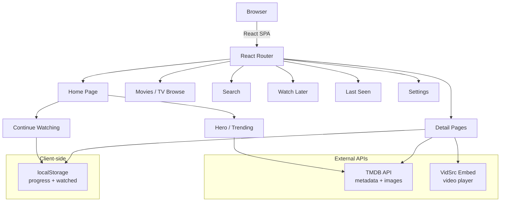

# StreamFlow

A personal streaming web app built with React and TypeScript. Browse movies and TV shows using TMDB metadata, watch via embedded players, and track your viewing progress — all client-side with no backend.

## Screenshots

<table border="0">
  <tr>
    <td width="50%" align="center" valign="top">
      
      <br />
      <sub><b>Landing Page</b></sub>
    </td>
    <td width="50%" align="center" valign="top">
      
      <br />
      <sub><b>Last Seen</b></sub>
    </td>
  </tr>
  <tr>
    <td width="50%" align="center" valign="top">
      
      <br />
      <sub><b>TV Series View</b></sub>
    </td>
    <td width="50%" align="center" valign="top">
      
      <br />
      <sub><b>Movie View</b></sub>
    </td>
  </tr>
</table>

## Architecture



## Features

- **Browse** movies and TV shows with filters (genre, country, year, sort order)
- **Search** across movies, TV shows, and people
- **Watch** content via embedded video player with resume playback
- **Continue Watching** tracks progress and shows unfinished content on the home page
- **Watch Later** save movies, shows, or individual episodes for later
- **Last Seen** view your watch history grouped by series
- **Auto-detect watched** episodes are marked automatically when you click Next or reach the end
- **Episode navigation** season/episode dropdowns with keyboard search, prev/next buttons
- **Trailers** YouTube trailers on detail pages when available
- **Recommendations** "You might also like" section on movie and show detail pages
- **Request cancellation** in-flight API requests are cancelled on navigation to prevent stale data
- **Error boundary** catches render crashes with retry button and error logging
- **Back to top** floating button appears after scrolling down
- **Accessibility** ARIA roles, labels, skip-to-content link, keyboard navigation, screen reader announcements
- **Dark theme** with responsive layout

## Tech Stack

- [React 19](https://react.dev) + [Vite](https://vite.dev) + TypeScript
- [React Router](https://reactrouter.com) for client-side routing
- [TMDB API](https://developer.themoviedb.org) for metadata, images, and search
- [VidSrc](https://vidsrc.fyi) for video embeds
- CSS Modules for scoped styling
- localStorage for all persistence (watched marks, progress, watch later lists)

## Getting Started

### Prerequisites

- Node.js 18+
- A free [TMDB API key](https://www.themoviedb.org/settings/api)

### Setup

```bash
git clone https://github.com/AdeiTamayo/StreamingPlatform.git
cd StreamingPlatform
npm install
```

Create a `.env` file in the project root:

```
VITE_TMDB_API_KEY=your_tmdb_api_key_here
```

Then run the dev server:

```bash
npm run dev
```

### Build

```bash
npm run build
```

Output goes to the `dist/` directory.

### Tests

```bash
npm run test
```

## Deploying to Vercel

This project is ready for Vercel deployment. The `vercel.json` configures SPA routing (all routes redirect to `index.html`).

1. Push to GitHub
2. Import the repo on [vercel.com](https://vercel.com)
3. Add your `VITE_TMDB_API_KEY` as an environment variable in the Vercel dashboard
4. Deploy

Vercel will auto-deploy on every push to `main`.

## Project Structure

```
src/
  api/
    tmdb.ts          # TMDB API calls with caching + AbortSignal support
    vidsrc.ts        # Embed URL builders
    storage.ts       # localStorage persistence
  components/
    Navbar.tsx       # Sticky top navigation with sidebar
    Player.tsx       # Video player with progress tracking
    MediaCard.tsx    # Poster card with rating and action buttons
    ErrorBoundary.tsx # Render crash catcher with retry
    Toast.tsx        # Toast notification system
    SeasonDropdown.tsx
    EpisodeDropdown.tsx
    FilterDropdown.tsx
    FilterBar.tsx
    DatePickerField.tsx
    CollectionSkeleton.tsx
  pages/
    Home.tsx         # Hero carousel + Continue Watching + Trending
    MovieDetail.tsx  # Movie detail with player, trailer, recommendations
    TVDetail.tsx     # TV detail with season/episode navigation
    MediaBrowse.tsx  # Unified browse for movies and TV shows
    Search.tsx       # Multi-search with pagination
    WatchLater.tsx   # Saved movies, shows, and episodes
    LastSeen.tsx     # Watch history grouped by series
    Settings.tsx     # Stats, storage, backup, video source
    NotFound.tsx     # 404 page
  hooks/
    useSearchFilter.ts   # Shared debounced fetch + pagination hook
    useAbortController.ts # Auto-abort in-flight requests on unmount
    useClickOutside.ts   # Detect clicks outside a ref
    useDropdownSearch.ts # Keyboard-driven type-to-search
  utils/
    logger.ts        # Debug and error logging to localStorage
  styles/
    shared.css       # Global shared styles
  config.ts          # Environment variable setup
```

## Notes

- All data is stored locally in your browser — no accounts, no server
- TMDB API responses are cached in localStorage for 24 hours (max 100 entries)
- The app uses a privacy-conscious setup: noindex tags, no analytics, no tracking
- Video playback quality and availability depend on the embed source
- Errors are logged to localStorage under `app_errors` for debugging

## License

This project is for personal use. Check the terms of service for TMDB and VidSrc before deploying publicly.
